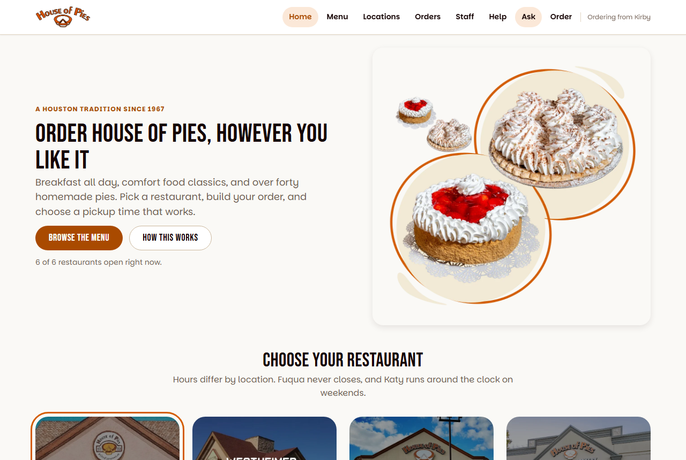

# House of Pies Ordering

An online ordering site for [House of Pies](https://houseofpies.com/), the Houston diner and bakery that's been around since 1967. Customers can browse the whole menu, order from any of the six locations, and keep track of their orders. Staff get their own side with the order queue, stock levels, and sales reports.

We built it for the FBLA 2026-2027 Introduction to Programming event, where the topic was a digital ordering system for a local business.



## Highlights

- The real menu: 426 items across 34 categories, with the restaurant's own prices and descriptions
- Runs offline from a single HTML file, with no server needed
- A Pie Assistant you can ask questions in plain English. It uses Llama 3.3 if you add a key and answers on its own if you don't
- Sales reports you can filter, group, compare with the previous period, and export to CSV
- No frameworks or libraries, just HTML, CSS, and JavaScript

## Running it

You need [Node.js](https://nodejs.org) 20 or newer. There's nothing to install.

```bash
npm start
```

Then open <http://localhost:4173>.

For the offline version:

```bash
npm run build
```

This creates `dist/standalone.html`, which opens with a double click. Keep the `dist` folder together, since the photos sit next to the file.

The staff PIN is 1967.

### AI answers (optional)

The assistant works without this. To have it answer with Llama 3.3 instead:

1. Make an account at [openrouter.ai](https://openrouter.ai), add a few dollars of credit, and create a key.
2. In the app, press Ask, then AI settings.
3. Paste the key and press Save key.

The key is only saved in your browser and never goes in the code. If it's rejected or the internet drops, the assistant falls back to its built-in answers.

## Testing

```bash
npm run check
```

This runs the tests, then a few checks we wrote ourselves: every function is documented, the logic never imports from the screens, nothing on screen is misspelled, and the numbers in our docs still match the code.

## How it covers the topic

| The topic asks for       | Where it is                                                                         |
| ------------------------ | ----------------------------------------------------------------------------------- |
| Products or services     | 355 food, drink, and bakery items, plus 71 catering items that need 48 hours notice |
| Place and manage orders  | Track, edit item by item, cancel, reorder, print a receipt                          |
| Calculate totals         | Money kept in whole cents, with the discount taken off before tax                   |
| Review order information | Receipts, order history, and a spending summary                                     |
| Unavailable items        | 11 items are sold out, and each one suggests substitutes                            |
| Inventory limits         | Stock is checked against what's already in your cart                                |
| Invalid entries          | Every input is checked for shape, then for whether it fits the order                |
| Budget constraints       | A spending limit that warns you, blocks checkout, and says what to remove           |
| Helping the business     | Pickup slots are capped so the counter doesn't back up                              |

## Project layout

```
src/js/
  data/     menu, locations, promos, help articles, past orders
  domain/   the logic: pricing, cart, stock, validation, reports
  app/      routing, saved state, the AI client
  ui/       screens and components
```

The code in `domain/` never imports from `ui/` or `app/`, so all of the logic can be tested without a browser. There's more in [docs/ARCHITECTURE.md](docs/ARCHITECTURE.md).

## Docs

- [User guide](docs/USER-GUIDE.md)
- [Architecture](docs/ARCHITECTURE.md)
- [Testing](docs/TESTING.md)
- [Libraries](docs/LIBRARIES.md)
- [Credits](docs/CREDITS.md)
- [Code style](docs/STYLE.md)
- [Rubric map](docs/RUBRIC-MAP.md)

## Credits

This is a student project and isn't affiliated with or endorsed by House of Pies. Their name, logo, photos, and menu belong to them. Prices were copied from their ordering page and may have changed since. See [docs/CREDITS.md](docs/CREDITS.md) for everything we used.

## License

[MIT](LICENSE)
